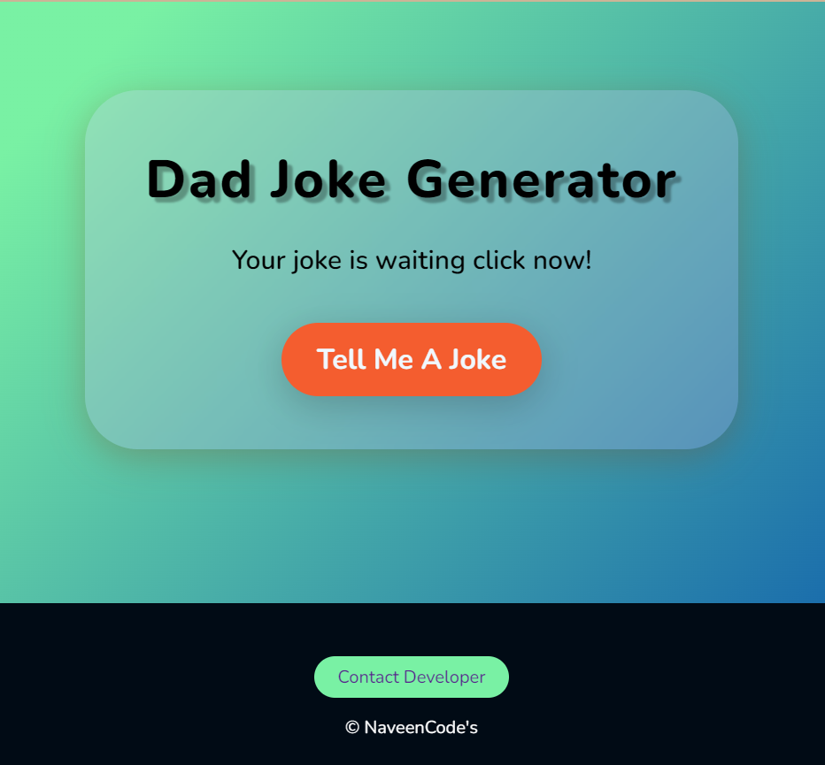

# Dad Joke Generator


Generate random dad jokes with this interactive website powered by HTML, CSS, and JavaScript. The jokes are fetched from the ["Dad Joke Generator" API provided by API Ninjas.](https://api-ninjas.com/api/dadjokes)



## Features

- Generate random dad jokes at the click of a button.
- User-friendly interface with a simple design.
- Jokes are fetched in real-time from the "Dad Joke Generator" API.
- Easy integration and customization.

## Live Demo

Check out the live project: [Dad Joke Generator](https://api-ninjas.com/api/dadjokes)

## Usage

1. Clone this repository to your local machine:

   ```bash
   git clone https://github.com/NaveenKumarDongre/dad-joke-generator.git

2. Open the index.html file in your web browser or host the  project on a web server.

3. Click the "Tell me a Joke" button to generate a random dad  joke.

## Contributing

   Contributions are welcome! Feel free to submit a pull request or open an issue if you have any suggestions or improvements for the project.
